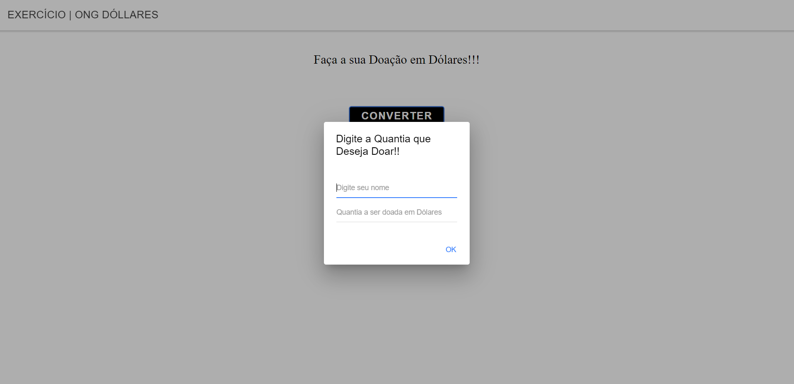

<h1 align="center"> Projeto Prova-Notas (Angular) </h1>

Portfolio Pessoal com HTML5, CSS3 e Javascript

---

 

  

---
## 💻 Tecnologias

Esse projeto foi desenvolvido com as seguintes tecnologias:

- Angular
- Ferramenta StackBlitz
- HTML5
- CSS3

---

## 🚧 Projeto

Projeto criado em Angular e Typescript pelo curso Técnico Desenvolvimento de Sistemas pela Etec Albert Einstein.
O usuário consegue fazer uma doação em Dólares para uma ONG Fictícia e o programa Mostra o valor doado em Dólares e Reais, fazendo a conversão automaticamente.
O programa feito está em: src/app/ app.component.ts e app.component.html e app.component.css

Você pode ver o site neste link: [Projeto Prova-Notas](https://stackblitz.com/edit/ionic6-angular13-rbs29h)

--- 
